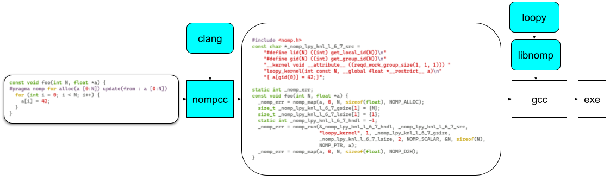

Introduction
============

nomp: Nomp isn't OpenMP
-----------------------

`nomp` is a pragma based programming model for C. It looks
superficially similar to OpenMP but acts more like OpenCL and/or
CUDA thus delivering the best of both worlds. `nomp` has its
own compiler (`nompcc`) and runtime (`libnomp`).

`nompcc` is a `clang` based compiler that can parse `nomp` pragmas
and convert them to `libnomp` library calls. This transformed
source code is then compiled using a user's favorite compiler
(like gcc or `nompcc` itself) and linked against `libnomp`.
`libnomp` runtime can be thought of as an abstraction on top of
other compute runtimes like OpenCL, CUDA, HIP, etc. `libnomp`
exposes APIs for managing host/device buffers as well as kernel
launches in a platform independent manner.

`nomp` workflow is shown in the following figure.

Real power of `nomp` comes from its use of `loopy` as a code
generator and runtime code transformer. `loopy` is a code generator
for array based code on both CPUs and GPUs. In contrast, to most
popular programming models like OpenMP/OpenCL/CUDA, etc., which force
the user to make implementation choices at program logic level,
`loopy` separate program logic from implementation details.
For example, all the afore mentioned programming models force the
programmer to decide memory location for the arrays used at compile
time (shared memory vs global memory vs register file) and how the
loops are mapped to hardware axes (grid and block configuration in
CUDA or NDRange in OpenCL). `loopy` provides an API for the user to
experiment and tune these details at runtime and thus providing a more
portable way of writing compute kernels. `libnomp` expose these
functionalities to user through easy to program pragmas.

.. toctree::
   :maxdepth: 3
   :caption: Table of Contents

   self
   build
   nomp-usage
   user-api
   internal-api
   developer-docs

Indices and tables
==================

* :ref:`genindex`
* :ref:`search`
